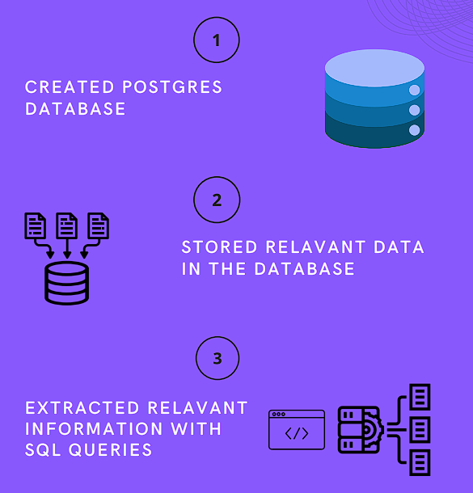
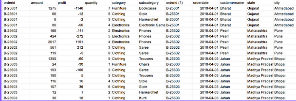
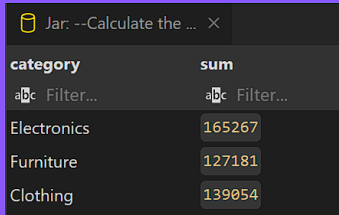
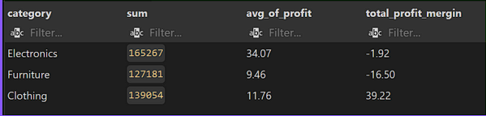
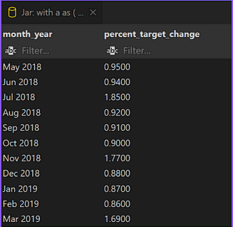
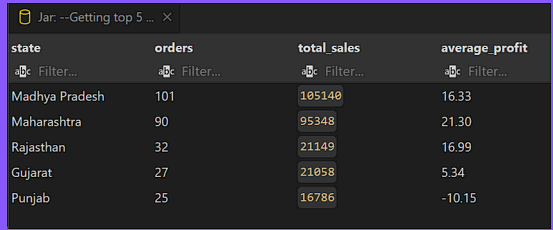

#  Assignment by Subhrajyoti Mahanta for Jar Business Analyst Internship


## Introduction

I am delighted to submit my assignment for the Business Analyst Intern position at Jar. I would like to extend my heartfelt thanks to the Jar team for giving me this opportunity to demonstrate my skills and to be a part of such an innovative organization.

In this assignment, I have addressed the technical challenges using PostgreSQL. I created a robust relational database to efficiently store and manage the relevant data, including orders, order details, and sales targets. By leveraging SQL, I was able to merge datasets, perform complex queries, and extract valuable insights required to solve the given problems.

This project not only allowed me to showcase my proficiency in database design and data querying but also provided a platform to apply analytical techniques to real-world business scenarios.

> **Access the GitHub Repository for this Assignment:**  
> [https://github.com/Subhrajyouti/Jar-BA-Intern-Assignment](https://github.com/Subhrajyouti/Jar-BA-Intern-Assignment)

---

## Approach for Getting Data Insights

To derive meaningful insights from the data, I followed these key steps:

1. **Stored Relevant Data in the Database**
2. **Created a PostgreSQL Database**
3. **Extracted Relevant Information with SQL Queries**

      

---

## Question 1: Sales Analysis

### Part 1: Sales and Profitability Analysis

- **Merge Orders and Order Details**  
  *SQL Query:*  
  ```sql
  SELECT *
  FROM order_details
  JOIN list_of_orders ON list_of_orders.orderid= order_details.orderid;
  ```
  *Results:*  
  

- **Total Sales for Each Category**  
  *SQL Query:*  
  ```sql
  SELECT category,sum(Amount)
  FROM order_details
  GROUP BY category;
  ```
  *Results:*  
  

- **Average Profit per Order & Total Profit Margin**  
  *SQL Query:*  
  ```sql
  SELECT category,sum(amount), round(avg(profit)::numeric,2) as   avg_of_profit,
       round(sum(profit::numeric/Amount::numeric)::numeric,2) as total_profit_mergin 
       FROM order_details
       GROUP BY category;   
  ```
  *Results:*  
  
  

- **Analysis and Recommendations:**  
  - **Best Performer: Clothing**  
    Clothing shows moderate sales with a high overall profit margin (39.22%). Its success indicates low costs and high demand.
  
  - **Mixed Results: Electronics**  
    Despite the highest sales (165,267) and average profit (34.07), the overall profit margin is negative (-1.92%), suggesting issues like high operating costs and discounting.
  
  - **Worst Performer: Furniture**  
    Furniture records the lowest mean profit (-16.50) and a highly negative profit margin, pointing to issues in cost management and pricing.

  **Recommendations:**  
  - For **Electronics**, review discounting strategies and operational costs.  
  - For **Furniture**, re-evaluate cost structures, supply chain inefficiencies, and pricing policies.  
  - Emulate successful strategies from the **Clothing** segment where feasible.

### Part 2: Target Achievement Analysis

- **Monthly Percentage Change in Furniture Sales Target**  
  *SQL Query:*  
  ```sql
   with a as 
   (    SELECT 
           months,
            to_char(months, 'Mon YYYY') AS month_year,
            TARGET, 
            lag(TARGET,1,0) OVER ( ORDER BY months) as past_target
    FROM 
            sales_target
     WHERE 
            category ='Furniture' 
        )    
        
    SELECT month_year,
       round((target-past_target)::numeric/target::numeric,4)*100  as percent_target_change
   FROM  a           
   join order_details as o on o.   
   WHERE  past_target >0  ;

   SELECT   to_char(l.OrderDate, 'Mon YYYY') AS month_year,
         sum(amount)
         FROM order_details as o
         join list_of_orders as l on l.orderid=o.orderid
           WHERE category = 'Furniture'
         GROUP by month_year;
  ```
  *Results:*  
  

- **Trend Analysis:**  
  - **Modest Increases:** Most months show a gradual increase of about 0.87% to 0.96%.  
  - **Significant Fluctuations:** Notable spikes in July 2018, November 2018, and March 2019.  
  - **Discrepancies:** Some months, such as July 2018, have a huge gap between target and actual sales, while January 2019 showed overperformance.

  **Recommendations:**  
  - **Data-Driven Target Setting:** Use historical trends and seasonality to refine targets.  
  - **Regular Reviews:** Conduct monthly or quarterly target revisions.  
  - **Incorporate External Factors:** Adjust targets based on economic, marketing, and competitive insights.

### Part 3: Regional Performance Insights

- **Top 5 States by Order Count:**  
  *SQL Query:*  
  ```sql
  SELECT state,
        count(DISTINCT l.orderid) as orders,
        sum(o.amount) as total_sales,
        round(avg(profit)::numeric,2)  as average_profit
   FROM list_of_orders as l
   JOIN order_details as o on o.orderid=l.orderid
    GROUP BY state
    ORDER BY orders DESC
    LIMIT 5;
  ```
  *Results:*  
  

- **Regional Disparities & Recommendations:**  
  - **Strong Performance Regions:**  
    - **Madhya Pradesh:** Highest order count (101) and total sales (105,140).  
    - **Maharashtra:** Second-best with 90 orders and the highest profit percentage (21.3%).
  
  - **Low Performing Regions:**  
    - **Rajasthan & Gujarat:** Fewer orders and low profit percentages (e.g., Gujarat at 5.34%).  
    - **Punjab:** Loss-making with only 25 orders and a -10% profit margin.

  **Recommendations:**  
  - **Punjab:** Re-assess pricing, operational costs, and product mix.  
  - **Gujarat:** Analyze cost structures and optimize operations.  
  - **Overall:** Leverage strategies from high-performing regions to uplift the underperforming ones.

---

## Question 2: App Exploration

### User-Friendly Features Found After Testing the Jar App

1. **Low Entry Barrier – Perfect for Students and Bachelors**  
   Jar allows saving and investing starting with just ₹10, making it very accessible for students and young professionals.

2. **CIBIL Score Without Aadhaar or PAN**  
   I was impressed that the app displays my CIBIL score instantly without needing Aadhaar or PAN details, streamlining the credit evaluation process.

3. **Efficient EMI Calculator**  
   The in-app EMI calculator effectively breaks down monthly payments, aiding in budgeting and financial planning.

4. **Attractive and Seamless UI**  
   The app's interface is visually appealing and intuitive, making navigation between savings, investments, and future loan options smooth and engaging.

5. **Upcoming Loan Feature – A Game Changer?**  
   There’s an in-development loan section that, if executed well, could provide emergency funds (under ₹1 lakh) with low interest—highly beneficial for college students.


### Areas for Improvement

1. **Privacy Concern with CIBIL Score**  
   Displaying the CIBIL score without identity verification raises privacy issues. More transparency is needed on data sourcing and security.

2. **Customer Care Button Issue**  
   The customer care button caused the app to buffer and freeze, which is problematic for an app dealing with financial data and transactions.

3. **High Charges for a Low-Income User Base**  
   Given that many users are students or low-income earners, reducing transaction fees could make the app more attractive and accessible.

4. **Withdrawal Waiting Period**  
   The current wait time for processing withdrawals is longer than necessary. Shortening this period would improve user satisfaction.

5. **Enhanced Budget Tracking**  
   In addition to the monthly expense tracker, adding functionality to create and manage budgets for specific categories (e.g., food, travel, rent) would empower users to better control their finances.

---

## Question 3: Product Exploration

With a strong user base established, Jar can further expand its ecosystem. Here are some new business opportunities to consider:

1. **Financial Literacy Programs**  
   - **Target Audience:** Students and households.  
   - **Initiative:** Launch courses, webinars, and mentorship sessions on investing, budgeting, and overall financial planning.  
   - **Benefit:** Increases user engagement and builds long-term loyalty.

2. **Diversified Investment Opportunities**  
   - **Proposal:** Introduce fractional investments in real estate and bonds with low entry barriers.  
   - **Advantage:** Enables portfolio diversification for users with limited funds.

3. **Micro-Lending Systems**  
   - **Concept:** Offer small, unsecured loans based on users’ savings and transaction behavior.  
   - **Outcome:** Provides financial flexibility while reinforcing Jar’s image as a comprehensive financial partner.

4. **Integrated Payment Solutions via UPI**  
   - **Implementation:** Incorporate UPI integration to allow users to make payments directly using their Jar balance.  
   - **Result:** Enhances daily app engagement and increases transaction volume.

5. **Stock Broking Services**  
   - **Vision:** Leverage the trusted database and user base to offer stock brokerage services with a simple, low-entry trading interface.  
   - **Impact:** Complements the existing savings and investment products, creating a holistic financial ecosystem.


---

## Conclusion

This assignment demonstrates my ability to extract meaningful insights from data and propose actionable strategies. Through a combination of robust SQL analysis and thoughtful business recommendations, I have addressed key areas including sales performance, app usability, and future product expansion for Jar.

Thank you for considering my application for the Business Analyst Internship at Jar.

---

*For any queries or further information, please feel free to reach out.*

---

*Subhrajyoti Mahanta*  
*Business Analyst Intern Applicant*  
subhrajyoutimahanta@gmail.com
https://www.linkedin.com/in/subhrajyotimahanta/
---


